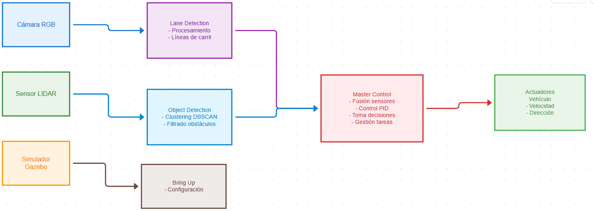
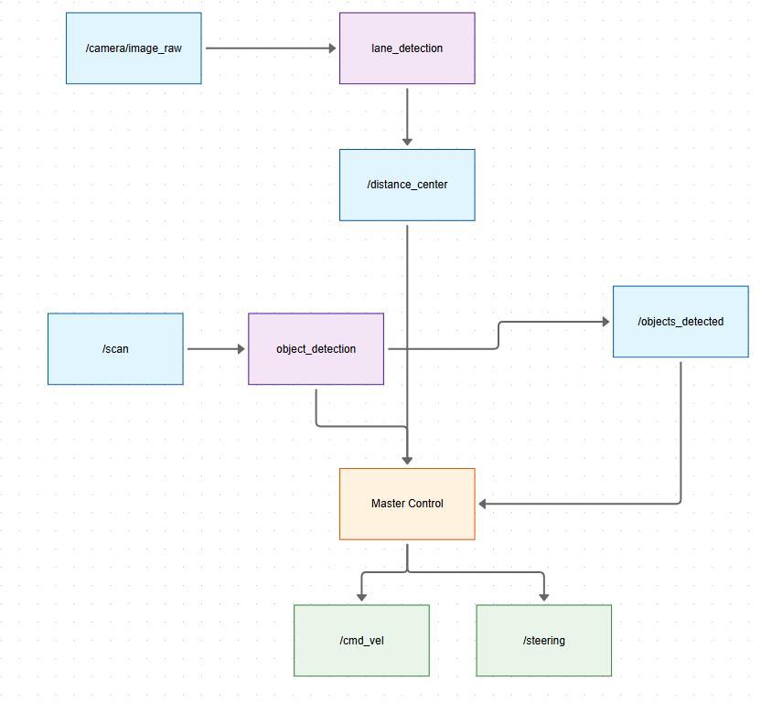

# Documentación Completa del Proyecto AVIM

## Sistema Autónomo de Navegación para Vehículo Autónomo

### Tabla de Contenidos

1. [Descripción General](#descripción-general)
2. [Arquitectura del Sistema](#arquitectura-del-sistema)
3. [Componentes Principales](#componentes-principales)
4. [Modos de Navegación](#modos-de-navegación)
5. [Diagramas del Sistema](#diagramas-del-sistema)
6. [Instalación y Configuración](#instalación-y-configuración)
7. [Uso del Sistema](#uso-del-sistema)
8. [Documentación de Paquetes](#documentación-de-paquetes)

---

## Descripción General

El proyecto AVIM (Autonomous Vehicle Intelligent Management) es un sistema completo de navegación autónoma desarrollado para vehículos modelo utilizando ROS (Robot Operating System). El sistema está diseñado para operar en diferentes escenarios de navegación, desde carreteras sin obstáculos hasta entornos complejos con obstáculos estáticos y dinámicos.

### Características Principales

- **Detección de carriles** mediante procesamiento de imágenes
- **Detección de obstáculos** usando sensores LIDAR
- **Control inteligente** con algoritmos de seguimiento y evasión
- **Múltiples modos de operación** adaptables a diferentes escenarios
- **Simulación en Gazebo** para pruebas y desarrollo

### Tecnologías Utilizadas

- **ROS Melodic/Noetic** - Framework de robótica
- **OpenCV** - Procesamiento de imágenes
- **Gazebo** - Simulación 3D
- **C++** - Lenguaje principal de desarrollo
- **Python** - Scripts de configuración y utilidades

---

## Arquitectura del Sistema

El sistema AVIM está compuesto por varios paquetes ROS que trabajan de manera coordinada:

```
AVIM_folder/
├── AVIM/                    # Paquete principal con launch files
├── control/                 # Controlador maestro del vehículo
├── lane_detection/          # Detección y seguimiento de carriles
├── object_detection/        # Detección de obstáculos generales
└── object_detection_parking/ # Detección específica para estacionamiento
```

### Flujo de Datos Principal

1. **Sensores** → Captura de datos (cámara, LIDAR)
2. **Procesamiento** → Análisis de imágenes y puntos LIDAR
3. **Decisión** → Algoritmos de control y navegación
4. **Actuación** → Comandos de velocidad y dirección

---

## Componentes Principales

### 1. Nodo Master (control)

- **Función**: Controlador principal del vehículo
- **Responsabilidades**:
  - Gestión de tareas de navegación
  - Control PID para velocidad y dirección
  - Toma de decisiones basada en sensores
  - Manejo de maniobras de evasión

### 2. Lane Detection

- **Función**: Detección y seguimiento de carriles
- **Tecnologías**: OpenCV, transformación perspectiva
- **Salidas**: Distancia al centro del carril, ángulo de corrección

### 3. Object Detection

- **Función**: Detección de obstáculos usando LIDAR
- **Algoritmo**: DBSCAN para clustering de puntos
- **Salidas**: Posiciones de obstáculos detectados

### 4. Object Detection Parking

- **Función**: Detección especializada para maniobras de estacionamiento
- **Características**: Algoritmos optimizados para espacios reducidos

---

## Modos de Navegación

El sistema AVIM opera en cuatro modos principales:

### 1. Navegación Sin Obstáculos

- **Launch**: `navigation_without_obstacles.launch`
- **Nodos activos**: lane_detection, Master
- **Descripción**: Navegación básica siguiendo carriles

### 2. Navegación con Obstáculos Estáticos

- **Launch**: `navigation_with_static_obstacles.launch`
- **Nodos activos**: lane_detection, object_detection, Master_static
- **Descripción**: Navegación con evasión de obstáculos fijos

### 3. Navegación con Obstáculos Dinámicos

- **Launch**: `navigation_with_dynamic_obstacles.launch`
- **Nodos activos**: lane_detection, object_detection, Master
- **Descripción**: Navegación con evasión de obstáculos móviles

### 4. Modo Estacionamiento

- **Launch**: `parking.launch`
- **Nodos activos**: lane_detection, object_detection_parking, Master_parking
- **Descripción**: Maniobras de estacionamiento autónomo

---

## Diagramas del Sistema

### Diagrama de Arquitectura



### Diagrama de Comunicación ROS



---

## Instalación y Configuración

### Prerrequisitos

- Ubuntu 18.04/20.04
- ROS Melodic/Noetic
- OpenCV 4.x
- Gazebo 9.x/11.x

### Pasos de Instalación

1. **Clonar el repositorio**:

   ```bash
   git clone <repository_url>
   cd TMR-2021-AutoModelCar
   ```

2. **Configurar el workspace**:

   ```bash
   cd catkin_ws
   catkin_make
   source devel/setup.bash
   ```

3. **Instalar dependencias**:
   ```bash
   rosdep install --from-paths src --ignore-src -r -y
   ```

---

## Uso del Sistema

### Ejecución Básica

Para cada modo de navegación, ejecutar en terminales separadas:

#### Terminal 1 - Simulación:

```bash
cd ~/catkin_ws
source devel/setup.bash
roslaunch bring_up <modo_navegacion>.launch
```

#### Terminal 2 - Control AVIM:

```bash
cd ~/catkin_ws
source devel/setup.bash
roslaunch AVIM <modo_navegacion>.launch
```

### Modos Disponibles:

- `navigation_without_obstacles`
- `navigation_with_static_obstacles`
- `navigation_with_dynamic_obstacles`
- `parking`

---

## Documentación de Paquetes

### Paquete: control

**Ubicación**: `catkin_ws/src/AVIM_folder/control/`

**Archivos principales**:

- `Master.cpp` - Controlador para obstáculos dinámicos
- `Master_static.cpp` - Controlador para obstáculos estáticos
- `Master_parking.cpp` - Controlador para estacionamiento

**Funcionalidades**:

- Control PID de velocidad y dirección
- Gestión de tareas de navegación
- Algoritmos de evasión de obstáculos
- Máquina de estados para diferentes maniobras

### Paquete: lane_detection

**Ubicación**: `catkin_ws/src/AVIM_folder/lane_detection/`

**Archivo principal**: `lane_detection.cpp`

**Funcionalidades**:

- Procesamiento de imágenes RGB
- Transformación de perspectiva (bird's eye view)
- Detección de líneas usando algoritmos de OpenCV
- Cálculo de distancia al centro del carril
- Estimación del ángulo de corrección

**Tópicos ROS**:

- **Suscribe**: `/camera/image_raw`
- **Publica**: `/distance_center`, `/angle_line`

### Paquete: object_detection

**Ubicación**: `catkin_ws/src/AVIM_folder/object_detection/`

**Archivo principal**: `object_detection.cpp`

**Funcionalidades**:

- Procesamiento de datos LIDAR
- Clustering DBSCAN para agrupación de puntos
- Filtrado de obstáculos por distancia
- Cálculo de centroides de obstáculos
- Visualización de detecciones

**Tópicos ROS**:

- **Suscribe**: `/scan`
- **Publica**: `/objects_detected`

### Paquete: object_detection_parking

**Ubicación**: `catkin_ws/src/AVIM_folder/object_detection_parking/`

**Funcionalidades**:

- Detección especializada para espacios de estacionamiento
- Algoritmos optimizados para maniobras en espacios reducidos
- Identificación de espacios libres

---

## Parámetros de Configuración

### Control PID

- `kp_angle`: Ganancia proporcional para control de dirección
- `kd_angle`: Ganancia derivativa para control de dirección
- `kp_speed`: Ganancia proporcional para control de velocidad

### Detección de Obstáculos

- `MINIMUM_POINTS`: Número mínimo de puntos para formar un cluster
- `EPSILON`: Distancia máxima para clustering DBSCAN
- `RANGE`: Rango máximo de detección LIDAR

### Navegación

- `dist_to_keep`: Distancia mínima a mantener con obstáculos
- `max_waiting_time`: Tiempo máximo de espera antes de maniobra
- `passing_enabled`: Habilitar/deshabilitar maniobras de adelantamiento

---

## Troubleshooting

### Problemas Comunes

1. **Error de compilación OpenCV**:

   ```bash
   sudo apt-get install libopencv-dev
   ```

2. **Nodos no se comunican**:

   - Verificar que `roscore` esté ejecutándose
   - Comprobar nombres de tópicos con `rostopic list`

3. **Simulación no inicia**:
   - Verificar instalación de Gazebo
   - Comprobar variables de entorno GAZEBO_MODEL_PATH

### Logs y Debugging

- Usar `rosnode info <node_name>` para información de nodos
- Monitorear tópicos con `rostopic echo <topic_name>`
- Visualizar en RViz para debugging visual

---

## Contribuciones y Desarrollo

### Estructura de Desarrollo

- Seguir convenciones de nomenclatura ROS
- Documentar nuevas funcionalidades
- Realizar pruebas en simulación antes de hardware real

### Extensiones Futuras

- Integración con sensores adicionales
- Mejoras en algoritmos de detección
- Optimización de rendimiento
- Implementación de nuevos modos de navegación

---

---

## Autor

**José Angel Balbuena Palma**  
GitHub: [JoseBalbuena181096](https://github.com/JoseBalbuena181096?tab=repositories)

---

## Video Demostración

🎥 **Video del Sistema en Funcionamiento**  
[Ver demostración del sistema AVIM](https://studio.youtube.com/video/6PzdKpFz6kk/edit)

---

**Equipo AVIM - Sistema de Navegación Autónoma**
